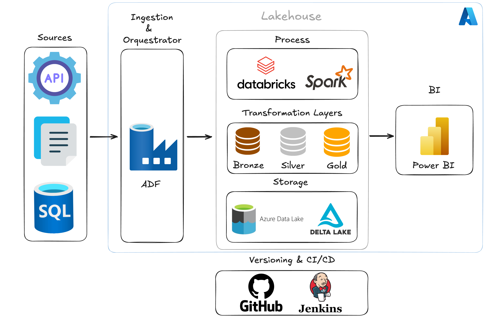
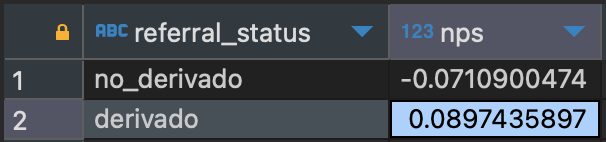
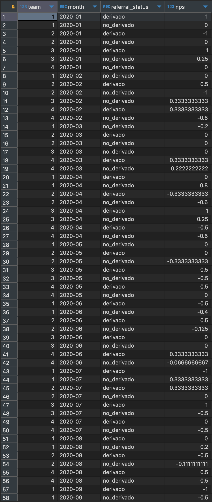

# Parte 1 - Ingesta de Datos

## Índice
- [Parte 1 - Ingesta de Datos](#parte-1---ingesta-de-datos)
  - [Índice](#índice)
  - [1. Stack de Tecnologías](#1-stack-de-tecnologías)
  - [2. Versionado \& CI/CD](#2-versionado--cicd)
  - [3. Planificación y Estrategia de Implementación](#3-planificación-y-estrategia-de-implementación)
    - [Requerimientos Previos](#requerimientos-previos)
    - [Etapas de Implementación](#etapas-de-implementación)
      - [Diseño del Pipeline](#diseño-del-pipeline)
      - [Desarrollo](#desarrollo)
      - [Pruebas](#pruebas)
      - [Despliegue](#despliegue)
  - [4. Estrategia de Monitoreo](#4-estrategia-de-monitoreo)
  - [5. Identificación de Puntos de Fallo](#5-identificación-de-puntos-de-fallo)
- [Parte 2 - Transformaciones de datos](#parte-2---transformaciones-de-datos)
  - [1. Se necesita calcular el NPS para dos categorías:](#1-se-necesita-calcular-el-nps-para-dos-categorías)
      - [a. Casos por mes que fueron derivados al menos una vez y casos que no tuvieron ninguna derivación.](#a-casos-por-mes-que-fueron-derivados-al-menos-una-vez-y-casos-que-no-tuvieron-ninguna-derivación)
      - [b. Se requiere visualizar el NPS por cada equipo de representantes y por mes.](#b-se-requiere-visualizar-el-nps-por-cada-equipo-de-representantes-y-por-mes)
  - [2. Proponer la forma de incorporar el procesamiento de los scripts en el pipeline existente.](#2-proponer-la-forma-de-incorporar-el-procesamiento-de-los-scripts-en-el-pipeline-existente)

## 1. Stack de Tecnologías


El stack de tecnologías propuesto para la empresa ACME utiliza un enfoque de lakehouse en la nube, aprovechando las herramientas del ecosistema de Azure junto con Databricks.

**Sources**: Las fuentes de datos incluyen principalmente bases de datos OLTP on-premise como Microsoft SQL Server u Oracle, así como archivos de texto y APIs.

**Ingestion**: Utilizaremos dataflows de ADF (Azure Data Factory) en un modelo `EL` (Extract and Load) para cargar datos en la capa Bronze. Para procesos más complejos, emplearemos `Azure Functions` dentro de ADF.

**Orquestador**: ADF se encargará de la orquestación debido a su simplicidad e integración, aunque también ofrecemos la opción de Managed Airflow si se requiere.

**Lakehouse**: Optamos por Databricks y Azure Data Lake Gen2 para la infraestructura del lakehouse. Databricks integra Spark y Delta Lake, permitiendo transacciones ACID sobre el data lake. Usaremos Azure Data Lake para almacenamiento en formato Parquet.

**Capas de Transformación**: Adoptamos la arquitectura Medallion con tres capas: Bronze, Silver y Gold.

- **Bronze**: Datos crudos extraídos de las fuentes. Aunque no es obligatorio, se recomienda almacenar en formato Parquet para un manejo eficiente.
- **Silver**: Datos validados y transformados, almacenados en formato Parquet y con sus respectivas tablas delta lake creadas.
- **Gold**: Datos procesados y/o agregados, optimizados para reportes y análisis.

## 2. Versionado & CI/CD
Implementaremos buenas prácticas de desarrollo de software, incluyendo versionado de ETLs y transformaciones, y utilizaremos prácticas de CI/CD para garantizar un proceso de despliegue fluido y controlado.

## 3. Planificación y Estrategia de Implementación

### Requerimientos Previos
- **Infraestructura en Azure**: Asegurarse de que Azure Data Lake Gen2 y Databricks estén configurados.
- **Conectividad**: Verificar el acceso a las fuentes de datos y permisos necesarios.
- **Configuración de Herramientas**: Confirmar la configuración de ADF y Databricks.

### Etapas de Implementación

#### Diseño del Pipeline
- **Definir el Proceso**: Planificar el flujo de datos desde las fuentes hasta el Data Lake, especificando cómo extraer, cargar y transformar los datos.
- **Configurar Dataflows**: Crear los dataflows en ADF para la capa Bronze y utilizar Azure Functions si es necesario.

#### Desarrollo
- **Implementar ETL**: Desarrollar y probar los procesos de Extract, Load y Transform en ADF y Databricks.
- **Configurar ADF**: Asegurarse de que ADF gestione las tareas y dependencias eficazmente.

#### Pruebas
- **Pruebas Unitarias**: Realizar pruebas para cada componente del pipeline.
- **Pruebas de Integración y Rendimiento**: Evaluar la integración y el rendimiento del pipeline con datos reales o simulados.

#### Despliegue
- **Implementar en Producción**: Desplegar el pipeline siguiendo prácticas de CI/CD.
- **Monitoreo**: Monitorear el pipeline para identificar y resolver problemas de manera oportuna.

## 4. Estrategia de Monitoreo
- **Monitoreo con ADF**: Utilizar las herramientas de monitoreo integradas de ADF para rastrear y gestionar la ejecución de los dataflows.
- **Alertas y Notificaciones**: Configurar alertas para notificaciones de fallos o problemas.
- **Dashboards de Monitoreo**: Implementar dashboards en Azure Monitor o Power BI para una visión general del estado del pipeline.

## 5. Identificación de Puntos de Fallo
- **Posibles Fallos**:
  - **Conexiones de Datos**: Problemas de conectividad con las fuentes de datos.
  - **Transformaciones**: Errores en la lógica de transformación.
  - **Configuración de ADF**: Fallos en dataflows o configuraciones incorrectas.
  - **Rendimiento**: Problemas durante la ingesta o transformación de datos.

- **Protocolo de Resolución de Incidentes**:
  - **Documentación y Diagnóstico**: Registrar y diagnosticar problemas detalladamente.
  - **Resolución Inicial**: Intentar resolver problemas siguiendo procedimientos estándar.
  - **Escalación**: Escalar a soporte si es necesario.

# Parte 2 - Transformaciones de datos

Para desarrollar los scripts SQL, primero hice unos scripts de python (directorio `create_csv_py`) para generar CSVs (directorio `csv`), que luego inserté en una base de datos postgres.

los DDLs utilizados para las 2 tablas de hechos y la tabla de dimensiones son estos: (directorio `sql`)

```sql
-- tabla de hechos interacciones
CREATE TABLE public.interacciones (
    case_id INTEGER PRIMARY KEY,
    interaction_id VARCHAR(10) NOT NULL,
    interaction_type VARCHAR(20) NOT NULL,
    representante VARCHAR(50),
    int_date DATE NOT NULL
);
```
```sql
-- tabla de dimensiones representantes
CREATE TABLE public.representantes (
    representante VARCHAR(50) PRIMARY KEY,
    full_name VARCHAR(100) NOT NULL,
    team INTEGER NOT NULL,
    incoming_date DATE NOT NULL,
    status VARCHAR(10) CHECK (status IN ('Active', 'Inactive'))
);
```
```sql
-- tabla de hechos nps
CREATE TABLE public.nps (
    survey_id SERIAL PRIMARY KEY,
    case_id INTEGER NOT NULL,
    nps_score INTEGER CHECK (nps_score BETWEEN 0 AND 10),
    ps_comment TEXT
);
```

Luego, siguiendo la consigna de desarrollar 2 scripts para cada punto, hice las siguientes transformaciones:

## 1. Se necesita calcular el NPS para dos categorías: 
#### a. Casos por mes que fueron derivados al menos una vez y casos que no tuvieron ninguna derivación.
  ```sql
  CREATE VIEW V_NPS_DERIVADO AS
WITH nps_grouped AS (
    SELECT n.case_id,
           CASE 
               WHEN n.nps_score >= 0 AND n.nps_score <= 6 THEN -1
               WHEN n.nps_score >= 7 AND n.nps_score <= 8 THEN 0
               WHEN n.nps_score >= 9 AND n.nps_score <= 10 THEN 1
           END AS nps_group
    FROM public.nps n
),
case_categories AS (
    SELECT DISTINCT i.case_id,
           CASE 
               WHEN i.interaction_type = 'rep_derivation' THEN 'referred'
               ELSE 'not_referred'
           END AS referral_status
    FROM public.interacciones i
),
nps_by_category AS (
    SELECT 
        cc.referral_status,
        COUNT(CASE WHEN ng.nps_group = 1 THEN 1 END) AS count_promoters,
        COUNT(CASE WHEN ng.nps_group = -1 THEN 1 END) AS count_detractors,
        COUNT(*) AS count_total
    FROM case_categories cc
    LEFT JOIN nps_grouped ng ON cc.case_id = ng.case_id
    GROUP BY cc.referral_status
)
SELECT 
    referral_status,
    (count_promoters - count_detractors) * 1.0 / count_total AS nps
FROM nps_by_category;
```

Decidí utilizar CTEs (common table expressions) más por un tema de claridad de que performance. El código cuenta con 4 pasos.
1. calcula los de nps_score por case_id de la tabla `public.nps`
2. determina las categorias 'derivado' y 'no_derivado' para la columna referral_status en la tabla `public.interacciones`
3. hace un count de los promotores, detractores y del total general, también hace un join entre los 2 CTEs previos
4. hace un query de la columna referral_status, y calcula el valor del nps en la columna nps
> ❕ **Nota** se multiplica (promoters - detractors) * 1.0 para forzar a que el resultado sea decimal en postgres

resultado:



#### b. Se requiere visualizar el NPS por cada equipo de representantes y por mes.
```sql
create view V_NPS_REP_TEAM_MO_RPT as 
WITH nps_grouped AS (
    SELECT n.case_id,
           CASE 
               WHEN n.nps_score >= 0 AND n.nps_score <= 6 THEN -1
               WHEN n.nps_score >= 7 AND n.nps_score <= 8 THEN 0
               WHEN n.nps_score >= 9 AND n.nps_score <= 10 THEN 1
           END AS nps_group
    FROM public.nps n
),
case_categories AS (
    SELECT i.case_id,
           CASE 
               WHEN i.interaction_type = 'rep_derivation' THEN 'derivado'
               ELSE 'no_derivado'
           END AS referral_status,
           i.int_date,
           r.team
    FROM public.interacciones i
    LEFT JOIN public.representantes r ON i.representante = r.representante
    WHERE i.representante IS NOT NULL
),
nps_by_team_and_month AS (
    SELECT 
        cc.team,
        TO_CHAR(cc.int_date, 'YYYY-MM') AS month,
        cc.referral_status,
        COUNT(CASE WHEN ng.nps_group = 1 THEN 1 END) AS count_promoters,
        COUNT(CASE WHEN ng.nps_group = -1 THEN 1 END) AS count_detractors,
        COUNT(*) AS count_total
    FROM case_categories cc
    LEFT JOIN nps_grouped ng ON cc.case_id = ng.case_id
    GROUP BY cc.team, TO_CHAR(cc.int_date, 'YYYY-MM'), cc.referral_status
)
SELECT 
    team,
    month,
    referral_status,
    (count_promoters - count_detractors) * 1.0 / count_total AS nps
FROM nps_by_team_and_month
ORDER BY month, team, referral_status;
```
El segundo script es relativamente parecido al script 1, solo que en este caso necesitamos que las agregaciones sean por año-mes y por equipo.

resultado:


## 2. Proponer la forma de incorporar el procesamiento de los scripts en el pipeline existente.

La manera en la que yo incluiría estas 3 tablas y sus transformaciones en la arquitectura Medallion sería:

**Bronze**: para el layer bronze cargaría las tablas fuente `interacciones`,`representates`,`nps` como archivos parquet en el data lake.

**Silver**: para le layer silver se crearían tablas delta lake para las 3 tablas mencionadas arriba, como también procesos de validación como `unique` y `not null` para ciertos campos.

**Gold**: aquí se encontrarían las agregaciones que realizamo (`V_NPS_DERIVADO` y `V_NPS_REP_TEAM_MO_RPT`), que contienen lógica de negocio, y estan listas para utilizarse en reportes.